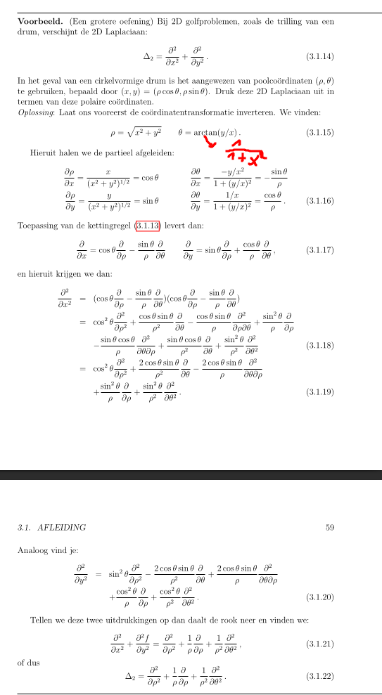
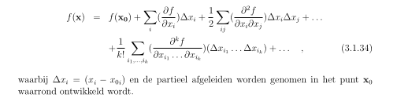
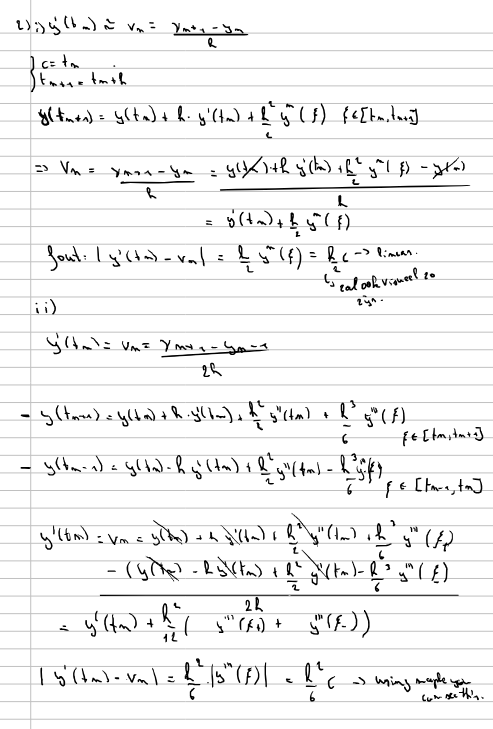
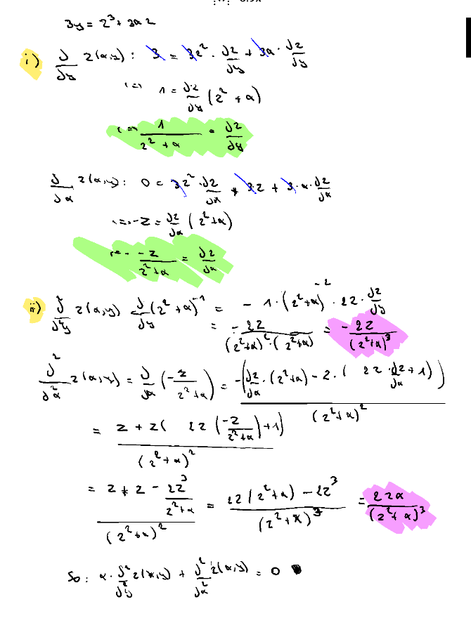

# Summary

> This is a summary of the lectures, exercises and other activities of the course "Mathematical Models" at the University of Gent.

## 1: Analyse in 1 veranderlijke: enkele aspecten

### 1.1 Continuiteitseigenschappen van functies

$f_x$ met interval $\omega = ]a, b[$ is **continue** als:

- $f_x$ betstaat in elk punt
- limiet van $f_x$ in elk punt van $\omega$ bestaat 

**In simpelere woorden**:
- Bestaat $f_x$ (in elk punt)
- Bestaat limiet $f_x$ (in elk punt)

$f_x$ is continue afleidbaar als:

- Als $f_x$ continue is
- Als $f_x$ afleidbaar is in elk punt van $\omega$
- Als NIET in elk punt? **Stuksgewijs**
- Als elke afgeleide continue is? **Glad**

Keywords: **Continue, stukgewijs afleidbaar, glad**

#### Example

1. $f_x$ is continu, maar stukgewijs afleidbaar (Hint, leidt functie af en merk op voor singulariteit)
2. $f_x$ is niet continu (zelfs wanneer je stukgewijs kijkt, zie je dat beide delen een singulariteit bevatten in $x = 1$, wel glad in de linker en rechter stuk)
3. $f_x$ is stukgewijs continue, stukgewijs glad

### Taylorontwikkeling

Concept: we willen zaken benaderen

met de fout $R_{k + 1}(x)$ = $\frac{f^{(k + 1)}(c)}{(k + 1)!} (x - c)^{k + 1}$
De fout is gedefinieerd tussen $x$ en $c$. Bv, voor $k + 1$ is de fout tussen $k$ en $k + 1$.

> Functie $f_x$ is **analytisch** als reeks convergeert.

#### Example

$lim_{x \to 0} \frac{sin(x)}{x} = 1$

Dit is omdat $sin(x)$ benaderd kan worden door $x$. (zie voorbeeld)

I have made an error when doing the binomial expansion. the correct form is = $(a + b)^3 = a^3 + 3a^2b + 3ab^2 + b^3$ 

Zelfs voor zaken uit de fysica kan het heel wat versimpelen, vooral $sin(x) \approx x$.

### Twee eenvoudige differentiaalvergelijkingen

Er zijn twee soorten differentiaalvergelijkingen in dit hoofdstuk:

- $y'(t) = \lambda y(t)$

$y(t) = y_0 e^{\lambda (t - t_0)}$

proof:

#### Example: Radioactief afval

- $y''(t) = \lambda y(t)$

In dit geval moet je 3 cases overlopen:

1. $\lambda = 0$

$y(t) = a + bt$

2. $\lambda > 0$

$y(t) = a e^{\sqrt{\lambda} t} + b e^{-\sqrt{\lambda} t}$

3. $\lambda < 0$

$y(t) = a cos(\sqrt{-\lambda} t) + b sin(\sqrt{-\lambda} t)$

### Complexe getallen

$z = a + bi$

$i^2 = -1$

**inverse**:
$z^{-1} = \frac{a - bi}{a^2 + b^2}$

**complex toegevoegde**:
$\bar{z} = a - bi$

**modulus**:
$|z| = \sqrt{a^2 + b^2}$

**polaire vorm**:

$e^(i\theta) = cos(\theta) + i sin(\theta)$

**Goniometrische formules**:

$cos(\theta) = \frac{e^{i\theta} + e^{-i\theta}}{2}$

$sin(\theta) = \frac{e^{i\theta} - e^{-i\theta}}{2i}$

$e^{i\theta n} = cos(n*x) + i sin(n*x) = (cos(x) + i sin(x))^n$

$cos(2x) = cos^2(x) - sin^2(x)$

$sin(2x) = 2sin(x)cos(x)$

### Hoofdstelling van de algebra

kwadratische vorm: $ax^2 + bx + c = 0$

oplossing: $x = \frac{-b \pm \sqrt{b^2 - 4ac}}{2a}$

## Chapter 2: Lineaire algebra

### Vectoren

> vectorruimte = verzameling vectoren die lineaire combinaties toelaten. Bevat ook nulvector

### Lineaire onafhankelijkheid

Linear onafhankelijk wanneer geen enkele vector een lineaire combinatie is van de andere vectoren.

#### Example

Hier kunnen we zien dat je met een simpele vermenigvuldiging of deling niet komt tot de andere vectoren.
Dit betekend dat {v1, v2}, {v1, v3}, {v2, v3} lineair onafhankelijk zijn.

> span: vectorruimte die opgespannen is door vectoren die lineaire zijn van elkaar.

### Inproduct, norm, orthogonaliteit

**Inproduct**: letterlijk een dotproduct

**Norm**: lengte van een vector

$||v|| = \sqrt{v_1^2 + v_2^2 + ... + v_n^2}$

**Orthogonaliteit**: wanneer de hoek tussen twee vectoren 90 graden is.

---

**Hoek tussen twee vectoren**:

$\frac{u.v}{||u||*||v||} = cos(\theta)$

We werken vaak met een orthonormale basis. Dit is een basis waarbij de vectoren orthogonaal zijn en een norm hebben van 1

**Grahm-Schmidt algorithm**:

1. $u_1 = \frac{v_1}{||v_1||}$
2. $u_2 = v_2 - (v_2.u_1)u_1$
   ...

#### Example

remember dat: $v = v^{||} + v^{\perp}$

### Functieruimtes

Dezelfde zaken als voor vectoren (inproduct, norm, orthogonaliteit) kunnen ook toegepast worden op functies.

Zie bordles en werkcollege voor meer info.

## Matrix

lineaire matrix: $Ax = y$

stel: mxn x nxp = mxp

#### Example

Een matrix matrix multiplicatie is niet commutatief.
$AB \neq BA$

**Transponeren**: Rijen worden kolommen en vice versa

$(AB)^T = B^T A^T$

### Kolomruimte/Rijruimte/Nulruimte

$Ax = b$

Typisch algorithm om dit op te lossen in de Gauss-elimanation.

> Kolomruimte van A: K(A) is opgespannen door de kolommen van A = span{a1, a2, ... an}

Voor de kolomruimte, de normaal op deze span is de nulruimte ($N(A)$) = orthogonaal complement. In dit geval is r(rang) < m
Hiervoor geldt: $0 = y . (Ax) = y^T Ax = x^t A^T y$

> Nulruimte van A: $N(A), Ax = 0$

> rang: $r$, the number of non-zero rows in the gaussian elimination form (in K(A)) else it would be columns in $K(A^T)$

> Rijruimte van A: $K(A^T)$, de $N(A)$ is hiervan het orthogonaal complement

##### Dimensies

$dim(K(A)) = dim(K(A^T)) = r$

$dim(N(A)) = n - r | dim(N(A^T)) = m - r$

if (r == m) => oplossingen

if (r == n) => unieke oplossing

if (r < m) => oneindig veel oplossingen

#### Example

$K(A)$ = de verschillende lineare combinaties van de kolommen van A

$N(A)$ = we willen $Ax = 0$, waarbij we dus de rijen van A willen combineren met de $N(A)$ zodanig dat deze 0 word. 

$K(A^T)$ = de verschillende lineare combinaties van de A

$N(A^T)$ = we willen de kolommen van A combineren met de $N(A^T)$ zodanig dat deze 0 word.

### Matrix Inverse

$A^{-1}A = I$

$x = A^{-1}b$

an example:
$(BA)^{-1} = A^{-1}B^{-1}$

### Projectie en kleinste kwadraten benadering

#### Projectie

Het idee is om een vector te projecteren op een andere vector.
Hierbij de volgende stelling:

$y = Py + (I - P)y$
met $P = A(A^TA)^{-1}A^T$

De projector heeft 2 properties:

- $P^2 = P$
- $P^T = P$

Gebruikmakend van de projector kunnen we ook de orthogonale component van een y vinden:
$y^{\perp} = (I - P)y$

Als we het bovenstaande zien, merken we dus ook op dat $y^{||} (projectie) = Py$

Vormt een basis voor een subruimte als kolommen/rijen lineair afhankelijk zijn met elkaar (lineaire combinatie).

#### Example

=> we can see that the projector is in the xy plane.

#### Kleinste kwadraten benadering

$x = (A^T A)^{-1} A^T y$

De gemiddelde hiervoor is MSE (mean squared error):

$MSE = \frac{1}{n} \sum_{i=1}^{n} (y_i - \hat{y_i})^2$
$MSE = \frac{1}{m} ||y^{\perp}||^2$
$MSE = \frac{1}{m} ||I - Py||^2$

#### Example

## Vierkante matrices

### Determinant

> Cofactor: is literally just the sign of the result of the determinant
> $C_{ij} = (-1)^{i + j} M_{ij}$

Paar eigenschappen:

- $det(A) = det(A^T)$
- Rij verwisselen / kolom verwisselen => $det(A) = -det(A)$
- Vermenigvuldigen met een constante => $det(cA) = c^n det(A)$
- det(A) != 0 -> matrix heeft volle rang r = n -> **rij vectoren zijn lineair onafhankelijk**
- det(AB) = det(A)det(B)
- det(A^(-1)) = 1/det(A)

**Inverse berekenen van matrix**: $A^{-1} = \frac{1}{det(A)} adj(A)$

Je berekend de adjunct door:

1. calculeer cofactor matrix (verwijder rij i en kolom j en zorg dat sign ok is)
2. transpose

### Basis Transformaties

Basic rotation matrix: 

$R(\theta) = \begin{bmatrix} cos(\theta) & -sin(\theta) \\ sin(\theta) & cos(\theta) \end{bmatrix}$

So a typical transformation equation looks like:

$\begin{bmatrix} x' \\ y' \end{bmatrix} = \begin{bmatrix} cos(\theta) & -sin(\theta) \\ sin(\theta) & cos(\theta) \end{bmatrix} \begin{bmatrix} x \\ y \end{bmatrix}$
with the middle matrix being **inverse**.

### Example

### Eigenvectoren, eigenwaarden, diagonalisatie en de Jordan-decompositie

$v_i$ is een eigenvector van A als $Av_i = \lambda_i v_i$

$p_A(\lambda) = det(A - \lambda I) = 0$

- geometrische multipliciteit: aantal lineair onafhankelijke eigenvectoren (je moet de eigenvalue invullen en row echelon reduced form verkrijgen. Dan zie je hoeveel eigenvectoren er degelijk zijn)

- algebraische multipliciteit: aantal keer dat de eigenwaarde voorkomt in de determinant

Indien alle geometrische multipliciteiten gelijk zijn aan de algebraische multipliciteiten, dan is de matrix diagonaliseerbaar.
-> $A = MDM^{-1}$

met $D$ een diagonale matrix met de eigenwaarden op de diagonaal.
en $M$ een matrix met de eigenvectoren.

**Jordan Form**:

$A = MJM^{-1}$
met $J$ een Jordan matrix.
Dit is nodig indien de dimensie van de eigenruimte (geometrische multipliciteit) kleiner is dan de algebraische multipliciteit.
Aka, de matrix is niet diagonaliseerbaar.

#### Example

This gives us:

#### Example

### Matrixmachten en iteratieve matrixvergelijkingen

$A^k = M D^k M^{-1}$ voor diagonaliseerbare matrices

$A^k = M J^k M^{-1}$ voor niet-diagonaliseerbare matrices

met diagonaal matrix:

**iteratieve matrixvergelijking**: $x_k = M D^k M^{-1} x_0$ Op deze manier kun je telkens de $k_{de}$ stap berekenen.

-> Dit is enkel voor de diagonaliseerbare matrices. ($A^k = M D^k M^{-1}$)

**asymptotisch gedrag**: $\lim_{k \to \infty} u_k = \lambda^k (v_{L1} * u_0) v_1$ 

$v_1$ is een fixed point in het asymptotisch gedrag.

#### Example

In het bovenstaande zien we dat $\lambda_1$ de dominante eigenwaarde is. Daardoor kunnen we de fixed point berekenen met:

$\lambda_1^k (v_{L1} . u_0) v_1$

Omdat $\lambda_1$ dominant is, nemen we voor $v_1$ de eerste kolom van $M$ en voor $v_{L1}$ de eerste rij van $M^{-1}$

Dit kan toegepast worden in de zogezegde **Markov proces**

algemene vorm: $u_k = P u_{k - 1}$
waarbij $P$ een matrix is die de overgangen tussen de verschillende states aangeeft met probabiliteit.
$\sum p_{ij} = 1$

Ook goed om te weten is dat wanneer de matrix strikt positieve getallen heeft, dat matrix $P$ een uniek dominante eigenwaarde $\lambda_1 = 1$ heeft met $v_1$ een positieve eigenvector. Deze $v_1$ is dan ook een fixed point.

#### Example

### Matrixexponent en lineaire differentiaalvergelijkingen

Hier gaan we een matrix plaatsen de exponent.

$e^{At} = M e^{Dt} M^{-1}$ -> concreet voorbeeld

**Algemeen**:

$e^{A} = \sum_{k=0}^{\infty} \frac{A^k}{k!}$

of

$e^{A} = M e^{D} M^{-1}$ || $e^{A} = M e^{J} M^{-1}$ (niet-diagonaliseerbare matrices)

In matrix vorm zie je het volgende:

[!Note] Maple geeft de functie `MatrixExponential(A, t)` om $e^{At}$ te berekenen.

### Example: eerste-orde differentiaalvergelijking

$y'(t) = Ay(t)$

$y(t) = e^{At} y(0)$

### Example: n-de differentiaalvergelijkin

[!Warning] Hetzelfde als hierboven

### Example: Herschrijf de tweede-orde differentiaalvergelijking $y''(t) + w^2 y(t) = 0$

### Symmetrische matrices

- $A = A^T$
- $A$ heeft enkel reele eigenwaarden
- $A$ heeft orthogonale eigenvectoren
- $A = ODO^T$ met $O$ een orthogonale matrix en $D$ een diagonale matrix

Omdat $O^T = O^{-1}$, kunnen we zeggen dat $O^T O = I$

Ook is het zo dat geometrische multipliciteit = algebraische multipliciteit. -> $A$ is diagonaliseerbaar.

### SVD (Singular Value Decomposition)

$A = U \Sigma V^T$

of

$A = \sum_{i=1}^{r} \sigma_i u_i v_i^T$

met $U$ en $V$ orthogonale matrices en $\Sigma$ een diagonale matrix met singular values

$U$ is mxm, $V$ is nxn en $\Sigma$ is mxn

#### Example

Als we compressie willen uitvoeren moeten we essentially SVD uitvoeren, maar onze som wordt beperkt door een rang $r'$

$A = \sum_{i=1}^{r'} \sigma_i u_i v_i^T$

## Hoofdstuk 3: Integratie en afleiding in $R^n$

### Partiele afgeleiden

$D_i f(x_1, x_2, ... x_n) = \frac{\partial f}{\partial x_i}$

#### Example

**Higher order partial derivatives**:

Basically hetzelfde, doe het gewoon na elkaar, van binnen naar buiten

### Kettingregel

When deriving, make sure to derive the respected variable as well.

### Coordinaten transformaties

Hier gaan we de coordinaten transformeren naar een andere coordinatenstelsel. (om het probleem zo gemakkelijk mogelijk te maken)

#### Example

1. Calculeer de $\rho$ en $\theta$ naar x en y
2. vorm de chain rule: $\frac{\partial}{\partial x} = \frac{\partial \rho}{\partial x} \frac{\partial}{\partial \rho} + \frac{\partial \theta}{\partial x} \frac{\partial}{\partial \theta}$
3. doe hetzelfde voor met respect tot y.
4. Vermenigvuldig twee maal met elkaar door de dubbele afgeleide
5. som met elkaar
6. Je hebt nu de laplacian

### Gradient en de differentiaal

**gradient operator**: $\nabla = \sum_{i=1}^{n} e_i \partial_i$ 

Via deze gradient kunnen we de richtingsafgeleide berekenen (variatie van een functie langs een kromme)

$\nabla f . \frac{dx}{dt}$

### Example

Hier zien we dat de gradient $\nabla = (\partial_x, \partial_y)$ = (1, 1) (want f(x, y) = x + y)

de richtingsafgeleide is dan $\nabla * f * \frac{d}{dt}$ = (1, 1) * (x_0, y_0) = x_0 + y_0

Als je de integraal pakt van t = 0 naar t = 1: $\int_0^1 x_0 + y_0 dt = x_0 + y_0$

> De gradient operator en richtingsafgeleide wordt gebruikt bij zaken zoals stochastic gradient descent, waar we proberen de lokale minima te vinden.

#### Example

1. Calculate the gradient

$\nabla f = (\partial_x, \partial_y) = (y, x)$

onze veldijn: $c = xy$
Note: We willen uiteindelijk kunnen zeggen dat onze richtingsafgeleide = 0, we hebben dus **dx** nodig

$y = \frac{c}{x}$

$dy = - \frac{c}{x^2} dx$

We weten ook dat onze displacement along the kromme $dx = (dx, dy)$

We weten nu wel $dy$ dus we vullen dit in: $dx = (dx, - \frac{c}{x^2} dx) = dx(1, - \frac{c}{x^2})$

We weten ook wat c is: $dx(1, - \frac{xy}{x^2}) = dx(1, - \frac{y}{x})$

Nu dat we de displacement hebben, vinden we de richtingsafgeleide:

$\nabla f * dx = (y, x) * dx(1, - \frac{y}{x}) = ydx - ydx = 0$

### Taylorreeks

Als wij $\triangle_{xi}$ (tweede term van taylorreeks), zien we $\nabla f * \triangle_{xi}$

Dit is een stationair punt wanneer $\nabla f = 0$

Er zijn hierbij 3 gevallen voor 1 variable:

- $\frac{\partial^2 f}{\partial x_i^2} > 0$ => minimum
- $\frac{\partial^2 f}{\partial x_i^2} < 0$ => maximum
- $\frac{\partial^2 f}{\partial x_i^2} = 0$ => saddle point (stationair buigpunt)

Voor meerdere variablen, maken we gebruik van de Hessiaan dat voorkomt in de tweede orde term van de taylorreeks:

- Hessiaan is symmetrisch, dus $H = O D O^T$

- als alle $\lambda_i > 0$ => minimum
- als alle $\lambda_i < 0$ => maximum
- als er zowel positieve als negatieve $\lambda_i$ zijn => saddle point
- als er eigenwaarden zijn die = 0, dan krijg je in sommige richtingen een stationair buigpunt gedefinieerd door de derde orde vorm van taylorreeks

#### Example

---

#### Exercises

##### Plenaire bordles 1

###### Oefening 1

###### Oefening 2

###### Oefening 3

##### Werkcollege 1

###### Oefening 1

###### Oefening 2

###### Oefening 3

##### Huis 1

###### Oefening 1

###### Oefening 2

###### Oefening 3

###### Oefening 4

##### Huis 2

###### Oefening 1

###### Oefening 2

###### Oefening 3

###### Oefening 4

###### Oefening 5

###### Oefening 6

We stellen eerst A op met de basisvectoren (vormen een basis voor $K(A)$ en $(K(A^T)$)):

$A = \begin{bmatrix} 1 & 0 & 1 \\ 1 & 2 & 0 \end{bmatrix}$

Hier zijn we al dat $N(A) = 0$, ook weten we dat voor $K(A^T)$, het orthogonaal complement de $N(A)$ is, en dus kunnen geen basis vormen lol.

###### Oefening 7

Calculating manually is useless for this exam...

###### Oefening 8

###### Oefening 9

##### PL 2

###### Oefening 1

// Maple
// i

// iii

// iv

This is done similarly as in the Home 2 exercise 4

###### Oefening 2

//Maple

###### Oefening 3

###### Oefening 4

###### Oefening 5

##### WC 2

###### Oefening 1

###### Oefening 2

###### Oefening 3

##### Huis 3

###### Oefening 1

###### Oefening 2

###### Oefening 3

###### Oefening 4

###### Oefening 5

###### Oefening 6

###### Oefening 7

###### Oefening 8

###### Oefening 9

##### Bordles 3

##### WC 3

##### Huis 4

###### Oefening 1

###### Oefeining 2

###### Oefening 3

###### Oefening 4

###### Oefening 5

##### Bordles 4

##### WC 4

##### Huis 5

// Todo

##### Bordles 5

##### WC 5
